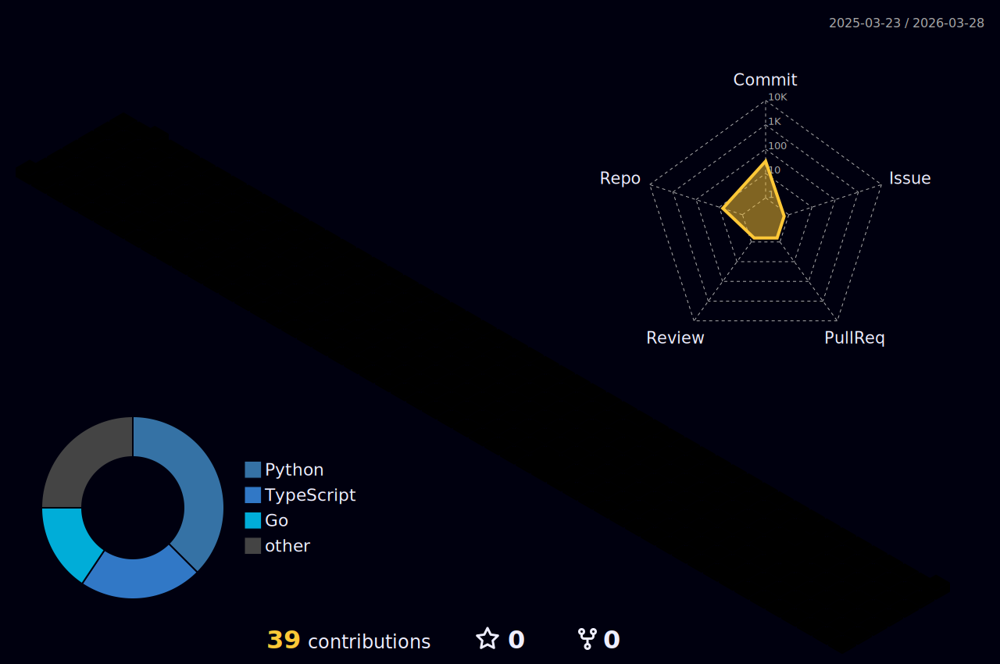

<!--
**latte-y/latte-y** is a ✨ _special_ ✨ repository because its `README.md` (this file) appears on your GitHub profile.

Here are some ideas to get you started:

- 🔭 I’m currently working on ...
- 🌱 I’m currently learning ...
- 👯 I’m looking to collaborate on ...
- 🤔 I’m looking for help with ...
- 💬 Ask me about ...
- 📫 How to reach me: ...
- 😄 Pronouns: ...
- ⚡ Fun fact: ...
-->

## Hi, I'm Yuki👋
I'm cloud infra engineer.

 

## Tech Stack 💻
 

 

## Certifications 🏆

 

## Contact ✉️
- [Linkedin](https://www.linkedin.com/in/yuki-nakamura-91080228b/?trk=opento_sprofile_topcard)

 

## Contributions 🔥
